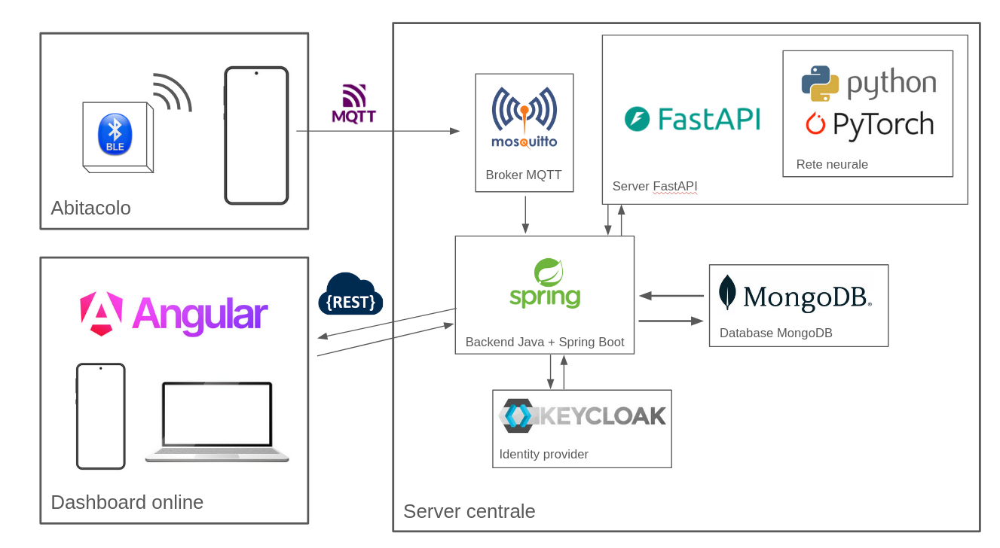

App Android per AUTOBLU
=======================

Di cosa si tratta?
------------------

*Autoblu* è una piattaforma che consente di monitorare e raccogliere statistiche sulla viabilità urbana. Si tratta di un portale che offre in tempo reale:

1. Previsioni sul traffico
2. Segnalazioni su eventuali cantieri, incidenti, manifestazioni, ecc.

A chi è rivolto?
----------------

 - Per l'amministrazione comunale: offre l'opportunità di raccogliere dati attendibili sulla congestione delle strade che però sono più ricchi rispetto a quelli che si otterrebbero da dei banali sensori, perché includerebbero non solo dati sulla "composizione" del traffico (tipologia di autovetture), ma anche sulla "demografia" (età, sesso).
   
 - Per il cittadino: offre una semplice app per (1) vedere le previsioni sul traffico, (2) vedere le segnalazioni del comune riguardo eventuali cantieri, incidenti, manifestazioni, ma anche di (3) inviare segnalazioni spontanee e anonime.

Come funziona?
--------------

I cittadini interessati si iscrivono alla piattaforma, registrando la propria autovettura e inserendo i propri dati personali. Fatto ciò, riceveranno un beacon BLE da installare nel veicolo che hanno scelto. Il beacon si comporta come "sentinella" per un'app mobile che, ad intervalli regolari, prova ad inviare una serie di dati via MQTT se e solo se ne capta la presenza.

I dati vengono così elaborati per generare statistiche sul traffico. Parte di questi dati (quelli relativi al flusso medio di veicoli per fascia oraria) verranno poi utilizzati per fare training di un modello di ML, una piccola rete neurale composta da un paio di layer utilizzata per effettuare previsioni (leggasi "regressione") sulla congestione del traffico in città.

Qual è l'architettura del progetto?
-----------------------------------

L'architettura della piattaforma è organizzata secondo un modello client-server.

L'utente effettua la registrazione e l'autenticazione tramite Keycloak. Una volta completata la registrazione, associa il proprio veicolo all'account e installa il beacon BLE ricevuto sul mezzo.

Quando il telefono rileva il beacon, l'applicazione acquisisce la posizione GPS e pubblica un messaggio MQTT contenente le coordinate e l'identificativo dell'utente. Il backend riceve il messaggio, lo valida e memorizza le informazioni all'interno di MongoDB.

I dati raccolti vengono successivamente aggregati per produrre statistiche consultabili dagli utenti e dall'amministrazione comunale.

Una parte dei dati viene inoltre trasformata in un dataset destinato all'addestramento del modello di Machine Learning.

Infine, un'applicativo web permette di consultare le statistiche prodotte dal backend, visualizzare le segnalazioni e inviare nuove comunicazioni da parte degli utenti.

Quali tecnologie sono state utilizzate?
---------------------------------------

- Per il backend: **Java + Spring Boot**
- Come identity provider: **keycloak**
- Per l'invio di dati dall'app al server: **MQTT**
- Per l'applicativo web: **Angular**
- Per l'addestramento e l'inferenza della rete neurale: **Python + PyTorch**

Cosa c'è in questa repository?
------------------------------

Questa repository contiene il codice sorgente per l'app Android, il cui obbiettivo è captare la presenza di un beacon e inviare dati ad un topic MQTT.

L’app è composta da due schermate, una per l’autenticazione e l’altra per l’invio dei dati. La scelta di dataset incentrati sul traffico di Bologna ha fatto sì che il modello di ML per la predizione del traffico risultasse ottimizzato per quella particolare città. Onde evitare degradazioni nelle performance della rete, si è scelto di focalizzare l’intero progetto proprio sulla città di Bologna. A conseguenza di ciò, si è visto necessario dover simulare numerosi aspetti, quali la posizione GPS e la velocità di percorrenza. Malgrado tutto, il sistema dimostra la fattibilità dell'architettura proposta e costituisce una base solida per futuri sviluppi.

Dopo l’autenticazione, l’app scansiona ad intervalli regolari alla ricerca di pacchetti di advertising emessi dalle sentinelle (beacon) BLE. Una volta rilevato un pacchetto di advertising, si controlla se il mittente appartiene alla lista delle sentinelle assegnate all’utente, e solo nel caso positivo viene dato il via alla pubblicazione dei dati statistici via MQTT. La frequenza di invio di questi dati è indipendente da quella di scansionamento, ed è stata arbitrariamente impostata a 30 secondi.

Link alle altre repository del progetto
---------------------------------------

- Frontend: ...
- Backend: ...
- Rete neurale: ...
- Docker compose: ...